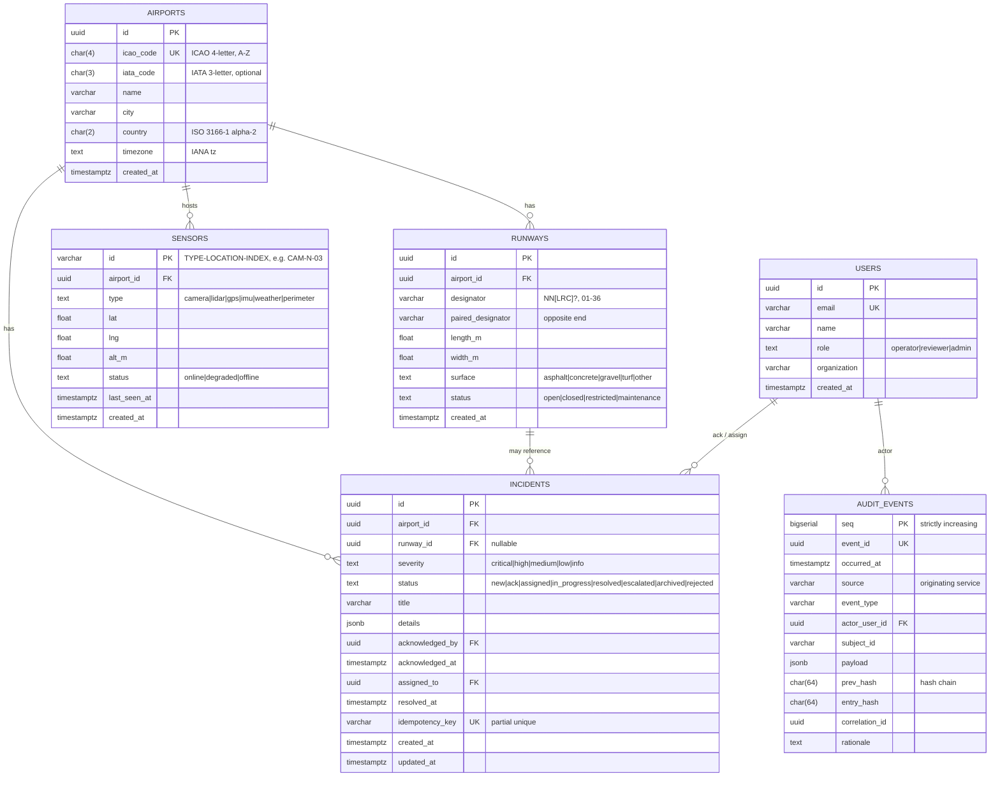

# Data Model

The platform's persistent state lives in PostgreSQL. This document is the source of truth for entities, their relationships, and the rationale behind column-level choices. Schema definitions live in [`@aip/db-schema`](../../packages/db-schema/) (Drizzle ORM); migrations are hand-authored SQL files committed alongside.

## ER diagram

## Column-level rationale

### Identity

- **UUIDs** on system-created entities (`airports`, `runways`, `users`, `incidents`). Generated via `uuid_generate_v4()` from the `uuid-ossp` extension (installed by `infrastructure/docker/postgres/init.sql`).
- **`sensors.id` is a `varchar`** following the operational `TYPE-LOCATION-INDEX` convention (e.g. `CAM-N-03`). This matches how airport ops actually name physical sensors and avoids translating between UUID and operational id every time a frame is published.
- **`audit_events.seq` is a `bigserial`** primary key — strictly increasing surrogate for deterministic ordering. `event_id` is the public uuid handle.

### Constraints

- Every enum-like column has a `CHECK` constraint that mirrors the corresponding zod enum in `@aip/shared-contracts`. Two sources, one truth; both must change together when an enum evolves.
- `airports.icao_code`, `iata_code`, and `country` carry shape regexes at the DB level.
- `runways.designator` enforces the `NN[LRC]?` format with NN ∈ [01..36] at the DB level — typos surface immediately.

### Idempotency

- `incidents.idempotency_key` is `varchar(200)` with a **partial unique index** (`WHERE idempotency_key IS NOT NULL`). NULL keys coexist freely; non-NULL keys cannot collide.

### Updated-at

- `incidents.updated_at` is maintained by a `BEFORE UPDATE` trigger (`set_updated_at()`). The application never sets it directly.

### Audit immutability

- `audit_events` is append-only **at the DB role level**. The migration runs `REVOKE UPDATE, DELETE, TRUNCATE ON audit_events FROM <app_role>`. The app simply cannot mutate this table once a row is in.
- The hash-chain (`prev_hash` + `entry_hash`) makes tampering detectable even by a privileged role that bypasses the grant model. See [ADR 0010](../adr/0010-audit-immutability.md).

### Cascade rules

| Parent → Child                                      | On delete                                                      |
| --------------------------------------------------- | -------------------------------------------------------------- |
| `airports` → `runways`                              | `CASCADE` (deleting an airport removes its runways)            |
| `airports` → `sensors`                              | `CASCADE`                                                      |
| `airports` → `incidents`                            | `RESTRICT` (cannot delete an airport with incidents on record) |
| `runways` → `incidents.runway_id`                   | `SET NULL` (incidents survive runway deletion)                 |
| `users` → `incidents.acknowledged_by`/`assigned_to` | `SET NULL`                                                     |
| `users` → `audit_events.actor_user_id`              | `SET NULL`                                                     |

### Indexing

| Index                                 | Pattern        | Why                                                              |
| ------------------------------------- | -------------- | ---------------------------------------------------------------- |
| `runways_airport_idx`                 | FK lookup      | All runway queries scope to an airport.                          |
| `sensors_airport_idx`                 | FK lookup      | Same.                                                            |
| `sensors_type_idx`                    | filter         | Operator views often slice by sensor type.                       |
| `incidents_airport_status_idx`        | composite      | Operator dashboard's primary query (per-airport open incidents). |
| `incidents_severity_idx`              | filter         | "Show me critical" workflow.                                     |
| `incidents_created_at_idx` (DESC)     | sort           | Default timeline ordering.                                       |
| `incidents_idempotency_key_uniq`      | partial unique | Deduplication on the event path.                                 |
| `audit_events_subject_idx`            | lookup         | Lineage retrieval per incident / submission.                     |
| `audit_events_correlation_idx`        | lookup         | "What happened during this request?" tracing.                    |
| `audit_events_event_type_idx`         | filter         | Filter audit by event class.                                     |
| `audit_events_occurred_at_idx` (DESC) | sort           | Default chronological view.                                      |

## Deferred entities

These are designed but not yet in the schema. They land alongside the consuming feature ticket:

| Entity               | Lands with                                        |
| -------------------- | ------------------------------------------------- |
| `submissions`        | T-405 (validation engine — primary intake record) |
| `documents`          | T-405 (uploaded evidence references)              |
| `validation_results` | T-405 (per-layer outcomes)                        |
| `risk_flags`         | T-408 (Layer 7 risk scoring)                      |
| `review_decisions`   | T-409 (HITL Layer 8)                              |
| `final_outputs`      | T-411 (Layer 10 certification)                    |

Designing them now would be premature — the validation-engine PR (T-405) will tell us exactly which columns matter.

## Versioning

Migrations are forward-only, sequentially numbered, and never edited in place. The migration runner records each migration's sha256; a hash mismatch on a previously applied migration aborts the run with a clear error.
